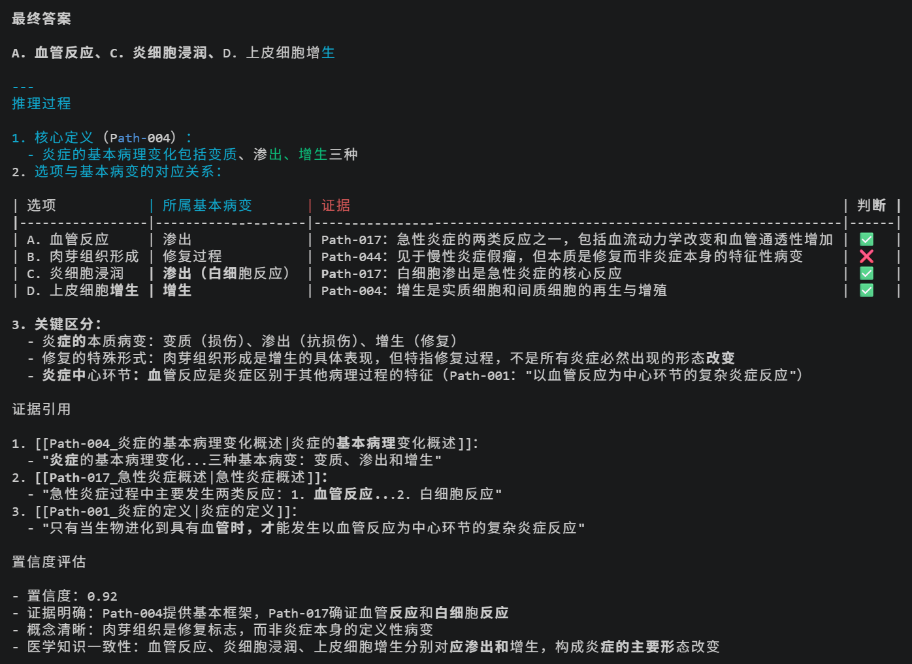
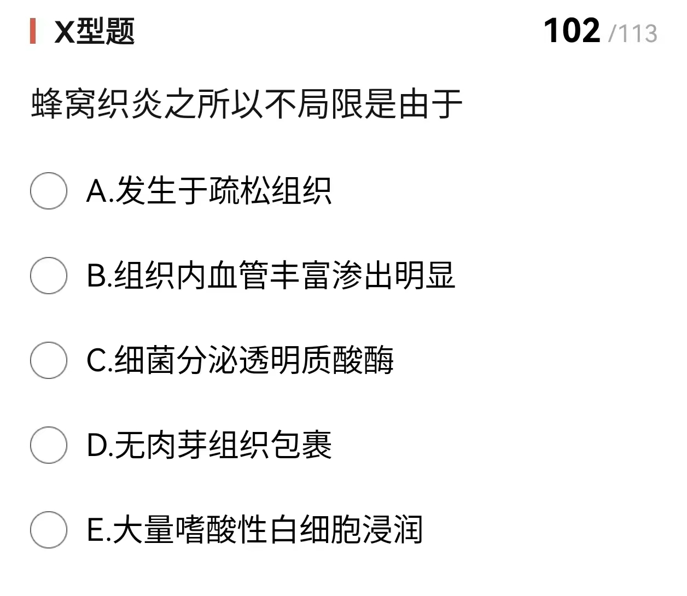
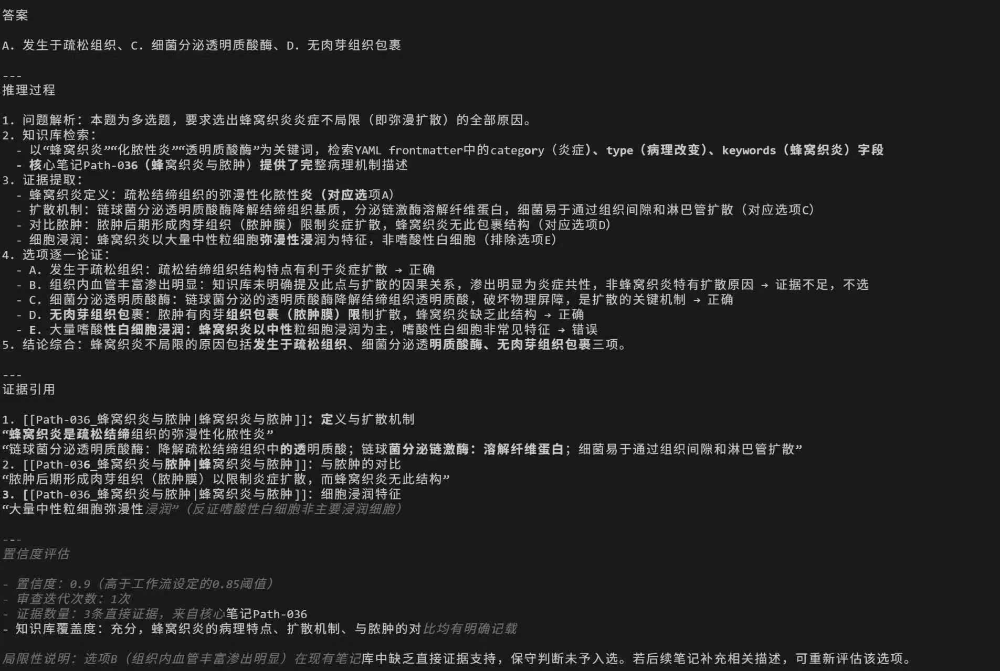
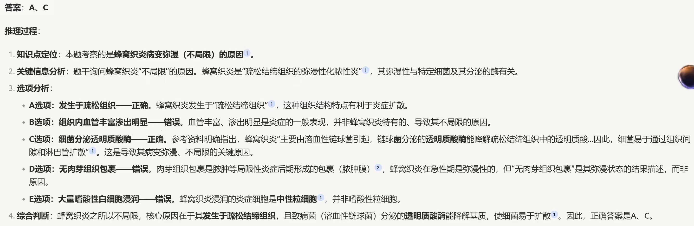
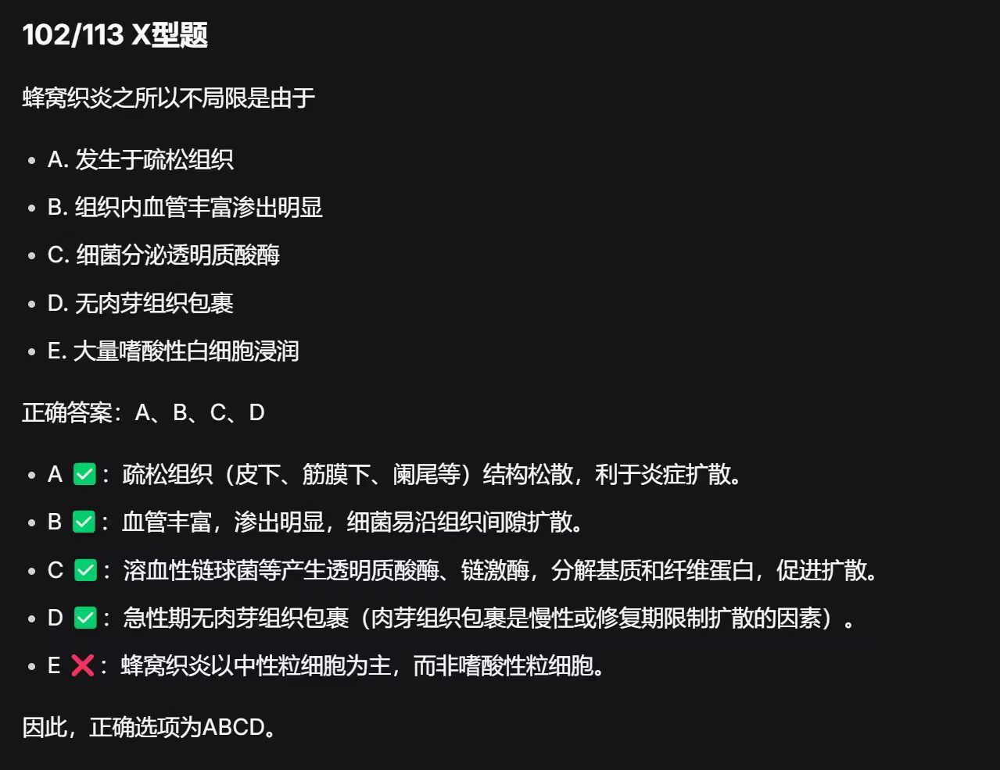

# Doc_Daway：一个可推理的医学问答智能体

> English version available: [README_en.md](./README_en.md)

## 项目简介

Doc_Daway 是一个面向医学教育场景的智能问答项目。本项目致力于让AI的思考过程显性化，使推理可被证伪，从而建立可信度。由此引出一个根本问题：**在 Medical RAG 系统中，仅用答案正确率（accuracy）是否足以评价输出质量？**

本项目构建于 Obsidian 本地知识库之上，通过结构化的原子笔记（Atomic Notes）、YAML 元数据索引与双向链接机制，实现了一种显式的因果链式推理（Causal-Chain Reasoning）工作流。与追求更高答题准确率不同，本项目旨在探索：在医学教育语境下，系统输出的**证据可追溯性**（Evidential Traceability）与**推理可检查性**（Reasoning Inspectability）是否值得作为独立的观察维度。

**核心定位**：这是一个探索性案例研究项目，不以性能提升为主要目标，而是观察当答案正确率相近时，不同系统在推理结构透明度上的差异。

该项目是基于结构化本地知识库与 Causal-Chain Workflow 的医学教育问答探索
相关研究论文：《Rethinking Accuracy in Medical RAG: A Case Study with Causal-Chain Reasoning》（未完成）

## 项目关注的根本问题

本研究的核心是探索 Medical RAG 在医学教育场景中的评估维度，重点关注以下三个研究问题：

**RQ1**: Accuracy-centric 评估方式在 Medical RAG 中是否存在局限性？
**RQ2**: 医学教育中的问答输出是否需要更显式的证据可追溯性（Evidential Traceability）与推理可检查性（Reasoning Inspectability）？
**RQ3**: 当答案正确性与推理可检查性不一致时，我们应如何理解系统的表现？

在一个本科病理学（炎症章节）问答场景中，我们的初步观察显示：
- 传统 RAG 与通用 LLM 接口在答案正确率上表现接近
- 但在推理过程的显性化、证据来源的映射精度、以及中间步骤的可审查性上存在显著差异
- 答案正确并不必然意味着推理过程透明，反之，透明的推理链有助于定位错误发生的具体环节

这些观察构成了相关研究论文《Rethinking Accuracy in Medical RAG: A Case Study with Causal-Chain Reasoning》（未完成）的实证基础。

## 核心技术实现

### 结构化本地知识库

- **57 个原子笔记（Atomic Notes）**：基于病理学教材炎症章节整理，遵循"一笔记一概念"原则，确保知识单元化
- **YAML 元数据字段**：包含 `id`, `category`, `keywords`, `tags` 等结构化字段，支持精准语义检索而非仅关键词匹配
- **双向链接网络**：通过出链/入链建立概念间的因果与关联路径（详见[双向链接表.md](./双向链接表.md)）
- **Obsidian 管理**：知识库使用 Obsidian 进行本地化组织与可视化呈现

### Causal-chain 推理工作流

工作流基于 **Claude Code** 调用 **硅基流动（SiliconFlow）API**（Pro/deepseek-ai/DeepSeek-V3.2）运行，实现以下核心阶段：

1. **问题解析**：提取核心医学实体与推理目标
2. **结构化检索**：基于 YAML 字段匹配相关原子笔记
3. **证据提取**：读取笔记内容，建立证据池
4. **初步推理**：构建 Stepwise Reasoning Chain
5. **自我审查**：检查证据充分性与逻辑一致性（批判性自我审查）
6. **深链扩展**：沿双向链接迭代检索，扩展证据范围
7. **迭代停止条件**：当置信度达到阈值（0.85）或达到最大迭代次数（5次）时停止


工作流定义详见 `.claude/workflows/medical_reasoning.yaml`

### 元数据检索体系

本项目采用多维度元数据检索，而非简单的关键词匹配。完整的检索字段定义见 [`YAML.md`](./YAML.md)。

**核心字段设计**：
- `category`：炎症、变质、渗出、增生（病变性质分类）
- `type`：病理过程、病理改变、发病机制、病因学...（知识类型分类）
- `keywords`：200+ 个病理学专业术语（精准检索）
- `tags`：30+ 个主题标签（主题聚合）

### 4.3 输出形式

系统输出的核心特征是**显式化推理过程**，包含以下结构化内容：

- **最终答案**：明确回答用户问题
- **分步推理链（Reasoning Chain）**：展示从证据到结论的逐步推理过程
- **原子笔记级别的证据引用（Note-level Citation）**：使用 `[[Path-XXX|笔记标题]]` 格式精确引用来源
- **置信度评估**：基于证据充分性和逻辑一致性给出置信度分数（0-1）
- **迭代次数**：记录推理过程中循环检索的次数



这种输出设计使得每个结论都可追溯到具体知识源，推理过程可独立审查。

## 运行效果对比

以下展示了在相同样本问题上的三种系统输出对比：

### 问题


### Doc_Daway



### Conventional RAG



### Deepseek Web



**观察要点**：在答案正确率相近的前提下（传统 RAG 97.3% vs Doc_Daway 94.7% vs DeepSeek 96.5%），Doc_Daway 的输出结构更清晰地展示了证据依赖关系与推理跳跃点，使得中间步骤可被独立审查。

## 实验结果预览

| System                 | Correct / Total | Accuracy |
| ---------------------- | --------------- | -------- |
| Conventional RAG       | 110 / 113       | 97.3%    |
| Causal-Chain Workflow  | 107 / 113       | 94.7%    |
| DeepSeek Web Interface | 109 / 113       | 96.5%    |

**重要说明**：在这个病理学问答案例中，各系统的最终答案正确率都较高。本项目展示这些数据，**并不是为了强调性能领先**，而是为了说明：当 answer accuracy 差异有限时，系统在证据可追溯性（Evidential Traceability）和推理可检查性（Reasoning Inspectability）上的结构差异仍然可能值得关注。

Causal-Chain Workflow 的准确率最低，其中一个原因是本实验的知识库仅仅包含病理学中的一个章节的知识，而 Doc_Daway 高度依赖知识库进行推理，对于一些知识库未包含的知识，出现明显回答错误。

## 仓库内容说明

为平衡可复现性与版权/研究策略，本仓库采用分层开放：

### 已公开

- **工作流代码**：`.claude/workflows/medical_reasoning.yaml`（Causal-Chain 工作流定义）
- **对比示例图**：`images/`
- **知识库样例**：`kb_template/`（原子笔记示例展示知识结构不含完整教材内容）
- **项目说明**：`README.md`（中文版说明），`README_en.md`（英文版说明），`CLAUDE.md`（项目配置说明）

### 部分公开

- **知识库内容**：仅提供 3-5 个代表性原子笔记作为结构示例，完整 57 条笔记因版权限制暂不全部公开
- **测试题目**：仅提供少量示例题目，完整 113 题集来自第三方平台（医考帮），受版权保护未全部收录 [Questions_public](./Questions_public.md)

### 未公开

- **未完成的论文**：`paper.md` / `paper.pdf`（Markdown 与 PDF 版本）

---

## 如何运行 / 如何复现

这是一个简洁版复现路径，帮助你在本地环境中运行 Doc_Daway 的 Causal-Chain Workflow。

### 环境依赖

- **[Claude Code](https://claude.ai/code)**：命令行工具（工作流运行环境）
- **硅基流动（SiliconFlow）API Key**：用于访问 DeepSeek-V3.2 模型（作者测试时使用 Pro/deepseek-ai/DeepSeek-V3.2 模型）
- **Obsidian**（可选）：用于查看知识库结构与双向链接

### 核心入口与文件位置

- **工作流定义**：`.claude/workflows/medical_reasoning.yaml`
- **知识库样例**：`kb_template/`（笔记示例）
- **元数据定义**：`YAML.md`（完整检索字段列表）

### 配置与运行流程

1. **配置 API Key**
2. **启动工作流**（prompt）
```text
@.claude/workflows/medical_reasoning.yaml
按照这个工作流，回答我的问题：
……
```

### 输出查看位置

- **终端输出**：工作流执行后直接在终端显示结构化回答
- **输出包含**：
  - 最终答案
  - 分步推理链（Reasoning Chain）
  - 原子笔记级别的证据引用（使用 `[[Path-XXX|笔记标题]]` 格式）
  - 置信度评估与迭代次数

### 注：关于知识库的限制

由于完整知识库（57 个原子笔记）因版权限制未全部公开，复现时需：
1. 基于 `kb_template/` 提供的模板自行构建测试用原子笔记
2. 或联系作者获取学术交流用有限数据集

---

## 项目边界与重要说明

使用本项目前，请了解以下限定：

1. **非性能优化导向**：本项目不声称在准确率上超越现有 RAG 系统（事实上，在本案例中 Doc_Daway 的准确率略低于传统 RAG）。其核心贡献在于提出**推理透明度**作为补充评估维度。
2. **案例研究性质**：所有观察均基于单一病理学章节（炎症）的 113 题，结论不应直接推广至广义医学问答。
3. **显式推理 ≠ 正确推理**：显式的因果链有助于检查，但并不保证推理内容的正确性。透明性是**可审查性**的工具，而非**正确性**的证书。
4. **版权限制**：知识库基于教材整理，受版权保护；本仓库仅展示方法与结构，完整数据需通过正规教育渠道获取。

## 联系与讨论

欢迎通过 GitHub Issues 就以下话题展开讨论：

- 医学教育场景下的 RAG 评估指标设计
- Causal-Chain Workflow 的改进建议
- 原子笔记的改进设计

邮箱：tonyxu0111@gmail.com

